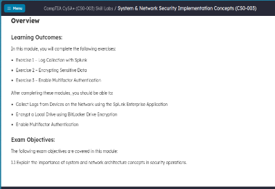
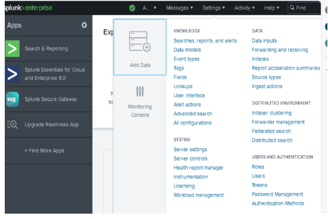
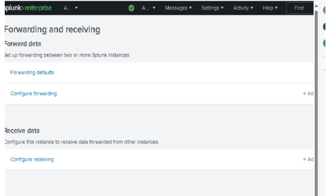
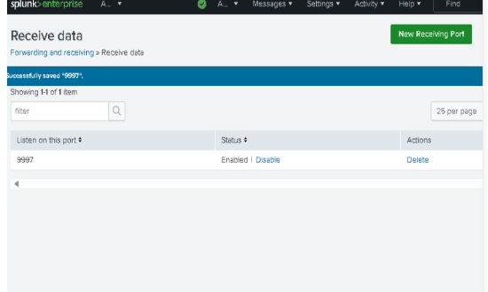
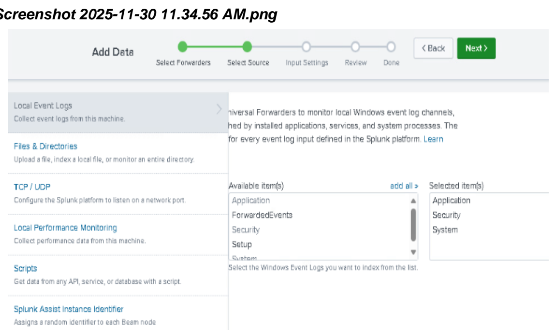

# Splunk Log Collection Project

This project demonstrates how to configure **Splunk Enterprise** with a **Universal Forwarder** to collect Windows Event Logs, secure the connection with Windows Firewall rules, and validate log ingestion in Splunk Search & Reporting.

---

## 📋 Lab Context

This lab comes from a CompTIA CySA+ / System & Network Security Implementation module.  
The focus here is on:

- Collecting logs from a Windows endpoint with Splunk Universal Forwarder  
- Configuring Splunk Enterprise to receive and index those logs  
- Verifying Security and System events in Splunk Search

---

## 🧱 Project Architecture

- **Splunk Enterprise (Indexer/Search Head)** – Receives and indexes logs on TCP port **9997**  
- **Windows Host (Universal Forwarder)** – Sends Windows Event Logs (Application, Security, System)  
- **Windows Firewall** – Inbound rules created for the UF program and TCP 9997  

---

## 🚀 Step-by-Step Overview

1. **Lab Overview**
   - Review the learning objectives and exercises from the ACI Learning / Skill Labs environment.

2. **Splunk Enterprise Setup**
   - Launch Splunk Enterprise and access the home dashboard.
   - Navigate to **Settings → Forwarding and receiving**.
   - Configure a **receiving port (9997)** for incoming UF data.

3. **Universal Forwarder Installation (Windows Client)**
   - Download and run the Splunk **Universal Forwarder** installer.
   - Specify the **deployment server / indexer IP** and management port.
   - Select **Windows Event Logs** (Application, Security, System) to forward.

4. **Windows Firewall Configuration**
   - Create a **Program-based inbound rule** to allow the UF executable.
   - Create a **Port-based inbound rule** to allow TCP **9997**.

5. **Add Data Wizard in Splunk**
   - Use **Add Data → Select Forwarders** to choose the UF host.
   - Select **Local Event Logs** as the source.
   - Choose which Windows logs to ingest (Application, Security, System).
   - Review the configuration and finish the wizard.

6. **Validate Log Ingestion**
   - Open **Search & Reporting** in Splunk.
   - Run a search for `source="WinEventLog:Security"` or `WinEventLog:System`.
   - Confirm logs from the host (e.g., `ACIDC01`) are visible.

---

## 🖼 Screenshots

All screenshots used in this project are stored in the [`images/`](./images) directory and embedded in the PDF.

Filenames are chronological, for example:

-










Security/System logs  

---

## 📄 PDF Documentation

A full walkthrough with all screenshots in order is available here:

📎 **[Splunk_Log_Collection_Project.pdf](./Splunk_Log_Collection_Project.pdf)**

You can attach or link this PDF on:

- Your **GitHub profile / portfolio**
- **LinkedIn posts**
- Job applications or interview prep material

---

## 🧰 How to Use This Repo

1. Clone the repo:
   ```bash
   git clone https://github.com/<your-username>/splunk-log-collection-project.git
   cd splunk-log-collection-project
   ```
2. Open the **PDF** to follow the step-by-step lab.
3. Browse the `images/` directory to see the raw screenshots.
4. Reuse this structure for future SIEM / Splunk projects.

---

## 🙌 Inspiration

This project is part of my journey toward blue team / SOC analyst roles, with a focus on:

- Log collection and visibility  
- SIEM configuration (Splunk)  
- Hands-on practice aligned with CompTIA CySA+

Feel free to **star** ⭐ the repo or fork it if it helps with your own studies.

